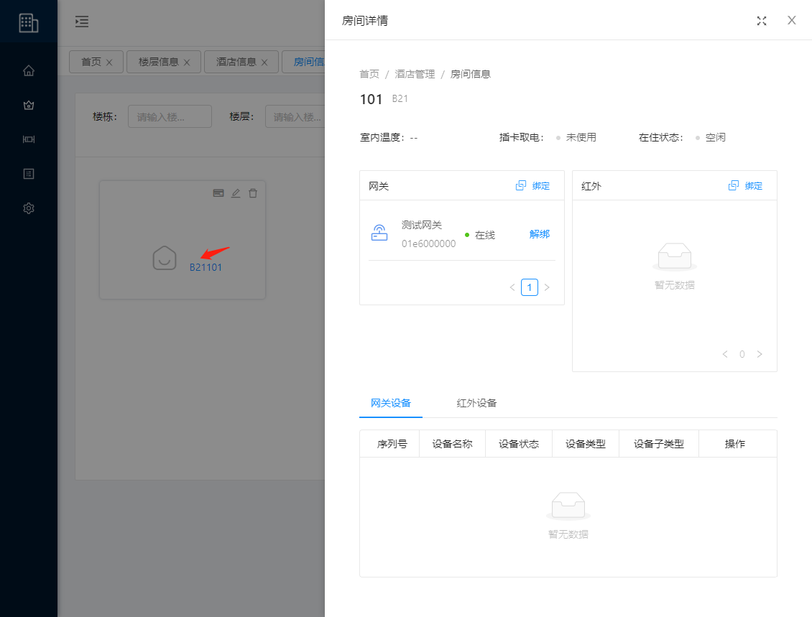

# 酒店管理

## 酒店信息

::: tip 描述
用于酒店管理的新增、修改、设置、账户解绑定、删除。
:::

### 新增

**操作步骤**

1. 进入系统: `酒店管理`-`酒店信息`-`添加酒店`。  

2. 输入酒店信息。  

3. 点击`确定`进行保存。  

  

### 编辑

**操作步骤**

1. 进入系统: `酒店管理`-`酒店信息`，在操作列点击`编辑`。

2. 编辑酒店信息。  

3. 点击`确定`进行保存。  

  

### 详情

**操作步骤**

1. 进入系统: `酒店管理`-`酒店信息`，在操作列点击`更多`-`查看详情`。

### 账户

**操作步骤**

#### 绑定账户

1. 进入系统: `酒店管理`-`酒店信息`，在操作列点击`更多`-`绑定账户`。

2. 点击`绑定` 按钮

3. 在`绑定酒店用户`窗口列表中，在操作列点击`绑定`

  

#### 解绑账户

**操作步骤**

1. 进入系统: `酒店管理`-`酒店信息`，在操作列点击`更多`-`绑定账户`。

2. 在`酒店账户`窗口列表中，在操作列点击`解绑`

### 设置

**操作步骤**

1. 进入系统: `酒店管理`-`酒店信息`，在操作列点击`更多`-`酒店设置`。

2. 编辑酒店设置信息。

3. 点击`确定`进行保存。

### 切换酒店

::: tip 描述
当前系统切换到指定酒店
:::

**操作步骤**

1. 进入系统: `酒店管理`-`酒店信息`，在操作列点击`更多`-`切换酒店`。

### 删除

**操作步骤**

1. 进入系统: `酒店管理`-`酒店信息`，在操作列点击`更多`-`删除`。

## 企业信息

::: tip 描述
用于企业管理的查询、新增、修改、删除。
:::

### 新增

**操作步骤**

1. 进入系统: `酒店管理`-`企业信息`-`添加企业`。  

2. 输入企业信息。  

3. 点击`确定`进行保存。  

### 编辑

**操作步骤**

1. 进入系统: `酒店管理`-`企业信息`，在操作列点击`编辑`。  

2. 编辑企业信息。  

3. 点击`确定`进行保存。  

### 删除

**操作步骤**

1. 进入系统: `酒店管理`-`企业信息`，在操作列点击`删除`。  

2. 在提示框中点击`确定`进行删除。

## 楼栋信息

::: tip 描述
用于楼栋的查询、新增、修改、删除。
:::

### 新增

**操作步骤**

1. 进入系统: `酒店管理`-`楼栋信息`-`添加楼栋`。  

2. 输入楼栋信息。  

3. 点击`确定`进行保存。  

### 编辑

**操作步骤**

1. 进入系统: `酒店管理`-`楼栋信息`，在操作列点击`编辑`。  

2. 编辑楼栋信息。  

3. 点击`确定`进行保存。  

### 删除

**操作步骤**

1. 进入系统: `酒店管理`-`楼栋信息`，在操作列点击`删除`。  

2. 在提示框中点击`确定`进行删除。

### 添加楼层

**操作步骤**

1. 进入系统: `酒店管理`-`楼栋信息`，在操作列点击`添加楼层`。  

2. 编辑楼层信息。  

3. 点击`确定`进行保存。

## 楼层信息

::: tip 描述
用于楼层的查询、新增、修改、删除。
:::

### 新增

**操作步骤**

1. 进入系统: `酒店管理`-`楼层信息`-`添加楼层`。  

2. 输入楼层信息。  

3. 点击`确定`进行保存。  

### 编辑

**操作步骤**

1. 进入系统: `酒店管理`-`楼层信息`，在操作列点击`编辑`。  

2. 编辑楼层信息。  

3. 点击`确定`进行保存。  

### 删除

**操作步骤**

1. 进入系统: `酒店管理`-`楼层信息`，在操作列点击`删除`。  

2. 在提示框中点击`确定`进行删除。

### 添加房间

**操作步骤**

1. 进入系统: `酒店管理`-`楼栋信息`，在操作列点击`添加房间`。  

2. 编辑房间信息。  

3. 点击`确定`进行保存。

## 房间信息

::: tip 描述
用于房间的查询、新增、修改、删除、设备绑定、设备控制等。
:::

### 新增

**操作步骤**

1. 进入系统: `酒店管理`-`房间信息`-`添加房间`。  

2. 输入房间信息。  

3. 点击`确定`进行保存。  

### 编辑

**操作步骤**

1. 进入系统: `酒店管理`-`房间信息`，在房间块右上角点击`编辑`按钮。  

2. 编辑房间信息。  

3. 点击`确定`进行保存。  

### 删除

**操作步骤**

1. 进入系统: `酒店管理`-`楼层信息`，在房间块右上角点击`删除`按钮。

2. 在提示框中点击`确定`进行删除。

### 房间详情

**操作步骤**

1. 进入系统: `酒店管理`-`房间信息`，在房间块点击`房号信息`。  

### 绑定网关

**操作步骤**

1. 进入房间详情，在网关版块点击`绑定`。

2. 选择目标网关设备，在操作列点击`绑定`。

### 解绑网关

**操作步骤**

1. 进入房间详情，在网关版块点击列表中的`解绑`。

2. 在提示框中，点击`确定`。  

### 绑定红外

**操作步骤**

1. 进入房间详情，在红外版块点击`绑定`。

2. 选择目标红外设备，在操作列点击`绑定`。

### 解绑红外

**操作步骤**

1. 进入房间详情，在红外版块点击列表中的`解绑`。

2. 在提示框中，点击`确定`。

### 控制网关设备

**操作步骤**

1. 进入房间详情，在红外版块点击列表中的`解绑`。

2. 选择目标网关设备，在操作列中点击`控制`

### 控制红外设备

**操作步骤**

1. 进入房间详情，在红外版块点击列表中的`解绑`。

2. 选择目标红外设备，在操作列中点击`控制`

