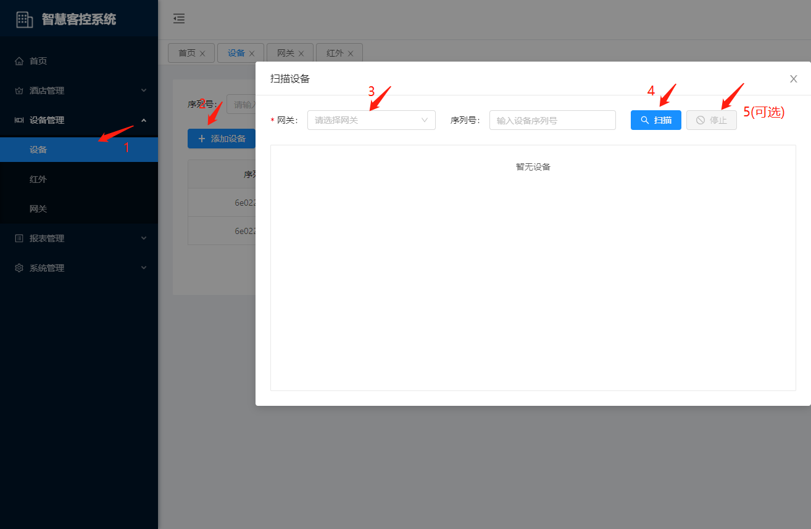
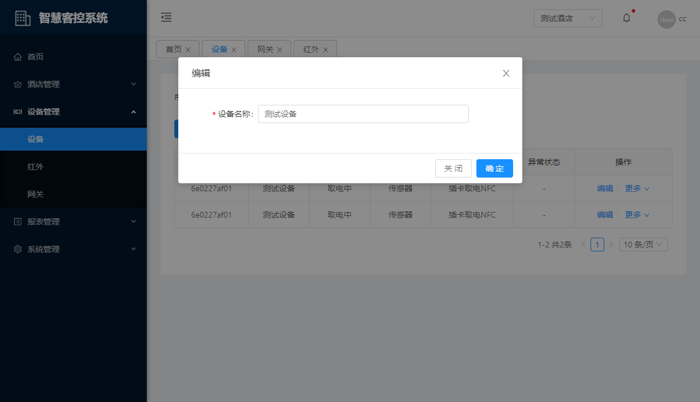
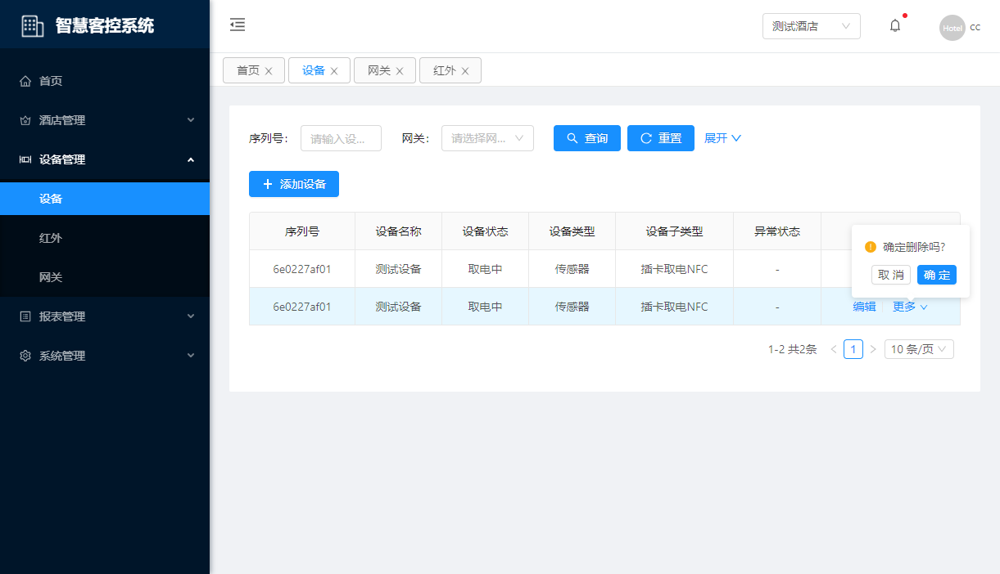

# 设备管理

## 设备

::: tip 描述
用于设备的新增、修改、控制、删除。
:::

### 新增

**操作步骤**

1. 进入系统: `设备管理`-`设备`-`添加设备`。  

2. 选择网关，点击`扫描` 按钮。

3. 中途需停止扫描，点击`停止`按钮。  

### 编辑

**操作步骤**

1. 进入系统: `设备管理`-`设备`，在操作列点击`编辑`。

2. 编辑设备信息。  

3. 点击`确定`进行保存。  

### 删除

**操作步骤**

1. 进入系统: `设备管理`-`设备`，在操作列点击`更多`-`删除`。

### 设备控制

**操作步骤**

1. 进入系统: `设备管理`-`设备`，在操作列点击`更多`-`停用`。

## 红外

::: tip 描述
用于红外的编辑、控制、删除。
:::

### 编辑

**操作步骤**

1. 进入系统: `设备管理`-`红外`，在操作列点击`编辑`。

2. 编辑红外信息。  

3. 点击`确定`进行保存。  

### 删除

**操作步骤**

1. 进入系统: `设备管理`-`红外`，在操作列点击`更多`-`删除`。

### 红外控制

**操作步骤**

1. 进入系统: `设备管理`-`红外`，在操作列点击`更多`-`停用`。

## 网关

::: tip 描述
用于网关的编辑、控制、删除。
:::

### 编辑

**操作步骤**

1. 进入系统: `设备管理`-`网关`，在操作列点击`编辑`。

2. 编辑网关信息。  

3. 点击`确定`进行保存。  

### 删除

**操作步骤**

1. 进入系统: `设备管理`-`网关`，在操作列点击`更多`-`删除`。

### 网关控制

**操作步骤**

1. 进入系统: `设备管理`-`网关`，在操作列点击`更多`-`停用`。

