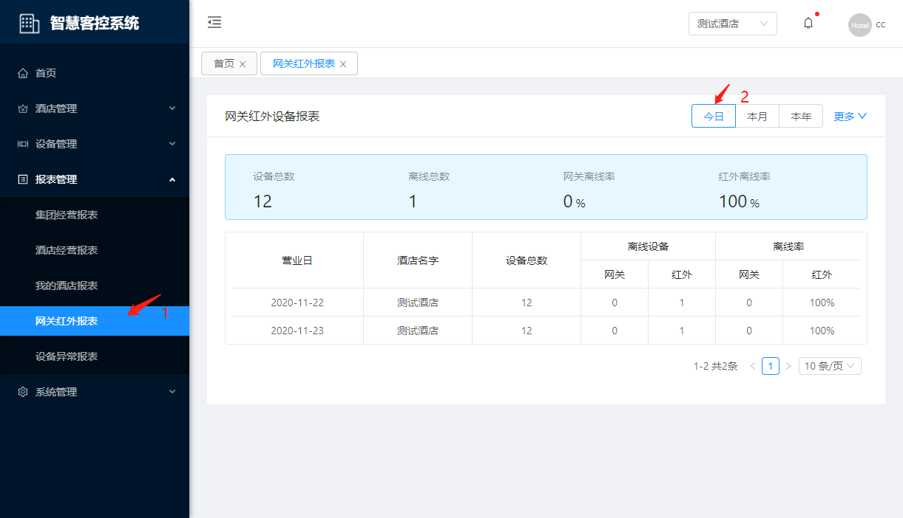
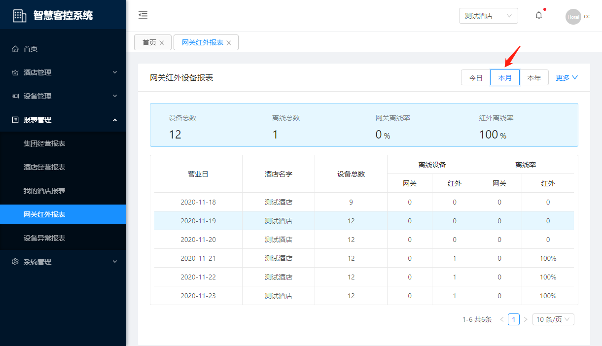
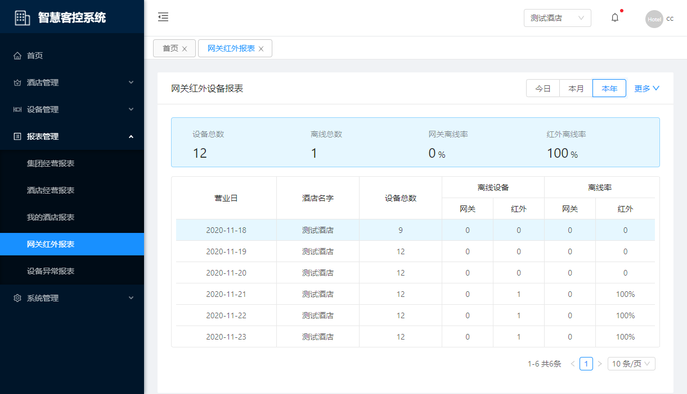
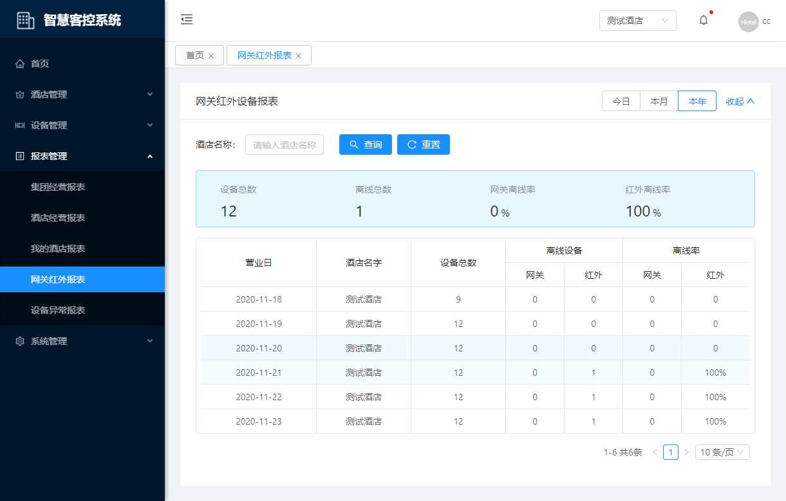
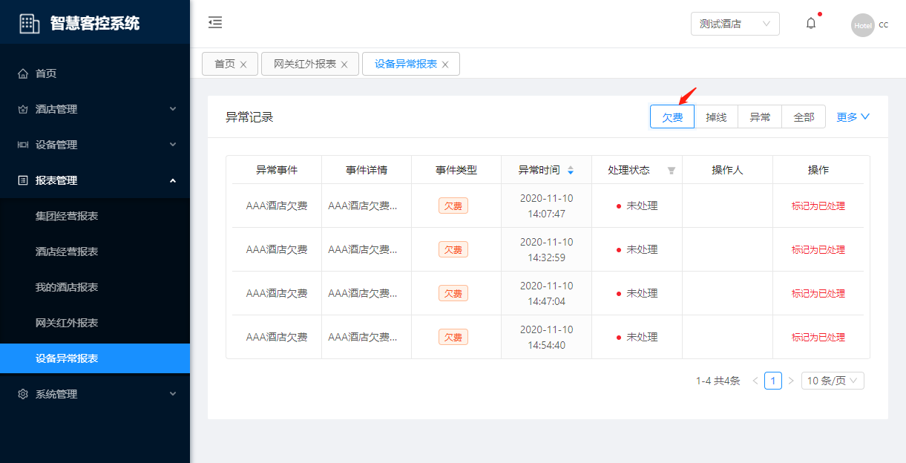
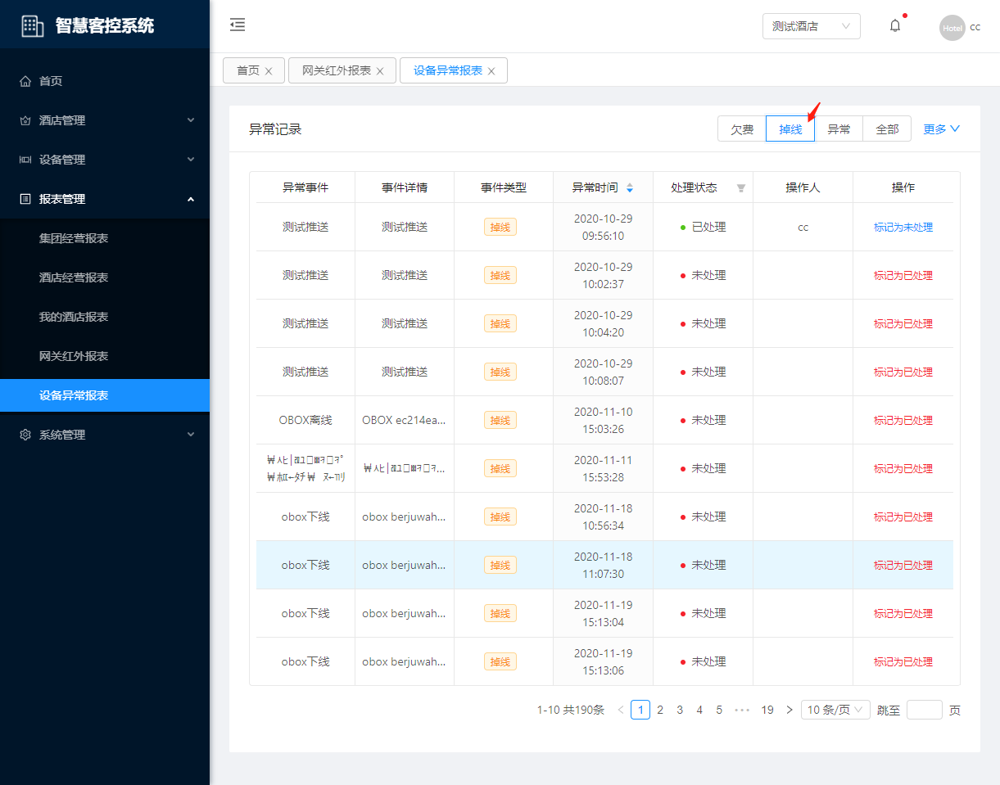
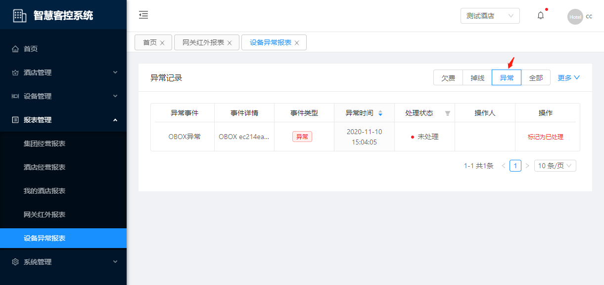
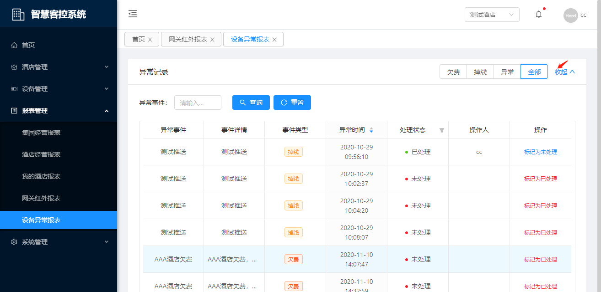

# 报表管理

## 集团经营报表

::: tip 描述
用于查询集团当日、单月、当年的经营数据状况
:::

### 今日数据

**操作步骤**

1. 进入系统: `报表管理`-`集团经营报表`，在右侧工具栏点击`今日`。

<!--  -->

### 本月数据

**操作步骤**

1. 进入系统: `报表管理`-`集团经营报表`，在右侧工具栏点击`本月`。

<!--  -->

### 本年数据

**操作步骤**

1. 进入系统: `报表管理`-`集团经营报表`，在右侧工具栏点击`本年`。

<!--  -->

## 酒店经营报表

::: tip 描述
用于查询酒店当日、单月、当年的经营数据状况
:::

### 今日数据

**操作步骤**

1. 进入系统: `报表管理`-`酒店经营报表`，在右侧工具栏点击`今日`。

<!--  -->

### 本月数据

**操作步骤**

1. 进入系统: `报表管理`-`酒店经营报表`，在右侧工具栏点击`本月`。

<!--  -->

### 本年数据

**操作步骤**

1. 进入系统: `报表管理`-`酒店经营报表`，在右侧工具栏点击`本年`。

<!--  -->

## 我的酒店报表

::: tip 描述
用于查询业务员负责的酒店当日、单月、当年的经营数据状况
:::

### 今日数据

**操作步骤**

1. 进入系统: `报表管理`-`我的经营报表`，在右侧工具栏点击`今日`。

<!--  -->

### 本月数据

**操作步骤**

1. 进入系统: `报表管理`-`我的经营报表`，在右侧工具栏点击`本月`。

<!--  -->

### 本年数据

**操作步骤**

1. 进入系统: `报表管理`-`我的经营报表`，在右侧工具栏点击`本年`。

<!--  -->

## 网关红外报表

::: tip 描述
用于查询网关红外设备当日、单月、当年的数据状况
:::

### 今日数据

**操作步骤**

1. 进入系统: `报表管理`-`网关红外报表`，在右侧工具栏点击`今日`。

### 本月数据

**操作步骤**

1. 进入系统: `报表管理`-`网关红外报表`，在右侧工具栏点击`本月`。

### 本年数据

**操作步骤**

1. 进入系统: `报表管理`-`网关红外报表`，在右侧工具栏点击`本年`。

### 更多条件

**操作步骤**

1. 进入系统: `报表管理`-`网关红外报表`，在右侧工具栏点击`更多`。

## 设备异常报表

::: tip 描述
用于查询设备欠费、掉线、异常记录情况
:::

### 欠费

**操作步骤**

1. 进入系统: `报表管理`-`设备异常报表`，在右侧工具栏点击`欠费`。

### 掉线

**操作步骤**

1. 进入系统: `报表管理`-`设备异常报表`，在右侧工具栏点击`掉线`。

### 异常

**操作步骤**

1. 进入系统: `报表管理`-`设备异常报表`，在右侧工具栏点击`异常`。

### 更多条件

**操作步骤**

1. 进入系统: `报表管理`-`设备异常报表`，在右侧工具栏点击`更多`。

