# 系统管理

## 用户管理

::: tip 描述
用于用户的添加、编辑、删除、冻结、修改密码
:::

### 添加

**操作步骤**

1. 进入系统: `系统管理`-`用户管理`-`添加用户`。  

2. 编辑用户信息。

3. 点击`提交`进行保存。  

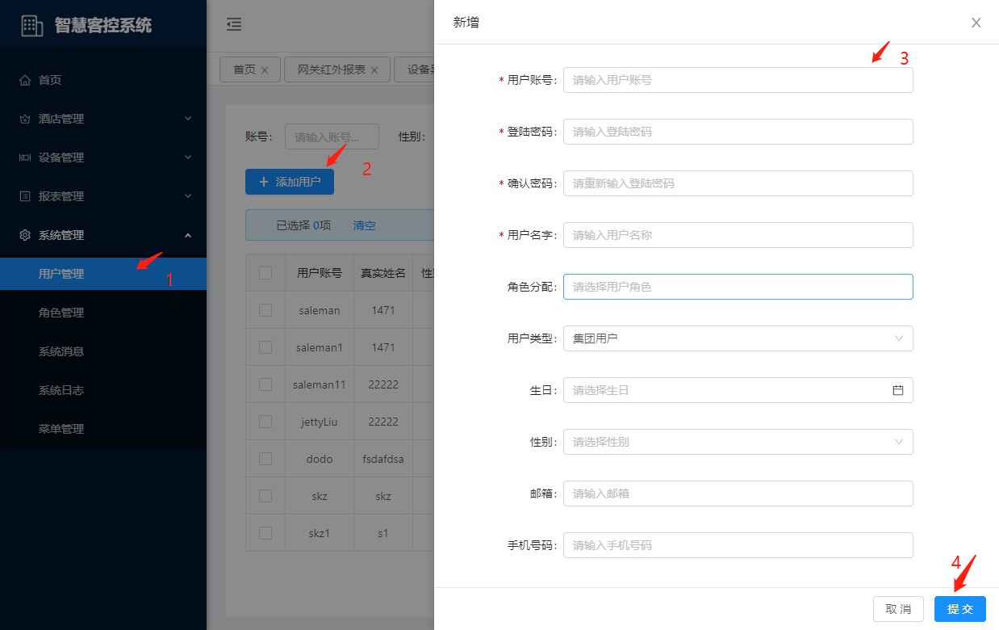

### 编辑

**操作步骤**

1. 进入系统: `系统管理`-`用户管理`，在操作列点击`编辑`。

2. 编辑用户信息。

3. 点击`提交`进行保存。  

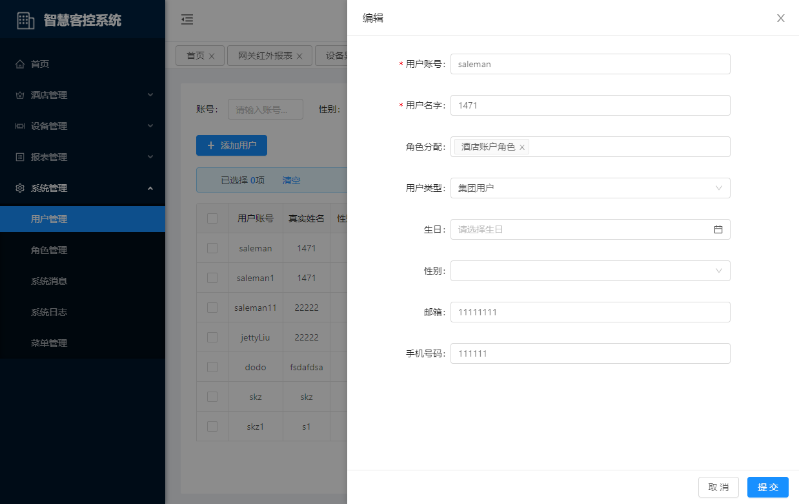

### 删除

**操作步骤**

1. 进入系统: `系统管理`-`用户管理`，在操作列点击`更多`-`删除`。

2. 在提示框中点击`确定`进行删除。

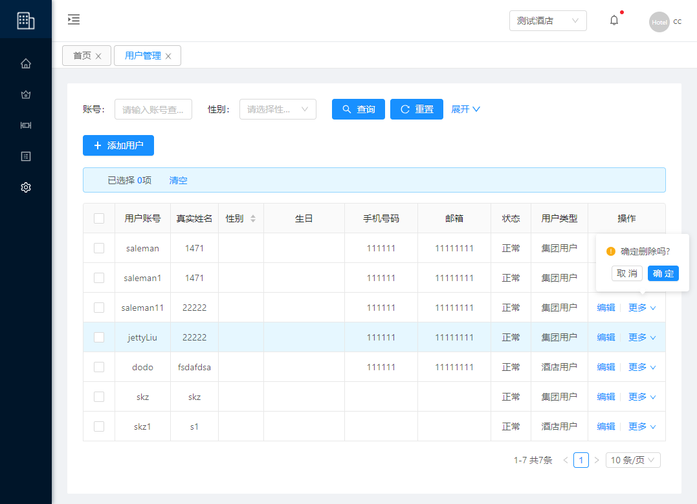

### 冻结/解冻

**操作步骤**

1. 进入系统: `系统管理`-`用户管理`，在操作列点击`更多`-`冻结`或`解冻`。

2. 在提示框中点击`确定`进行冻结或解冻用户。

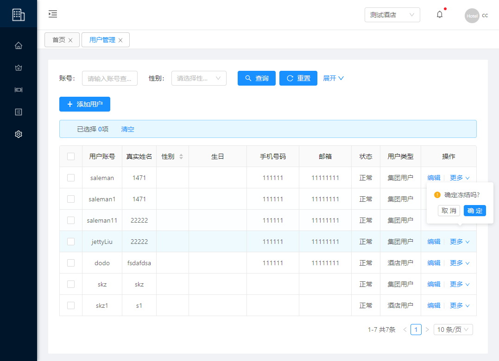

### 重置密码

**操作步骤**

1. 进入系统: `系统管理`-`用户管理`，在操作列点击`更多`-`密码`。

2. 编辑密码信息。

3. 点击`确认`进行保存。

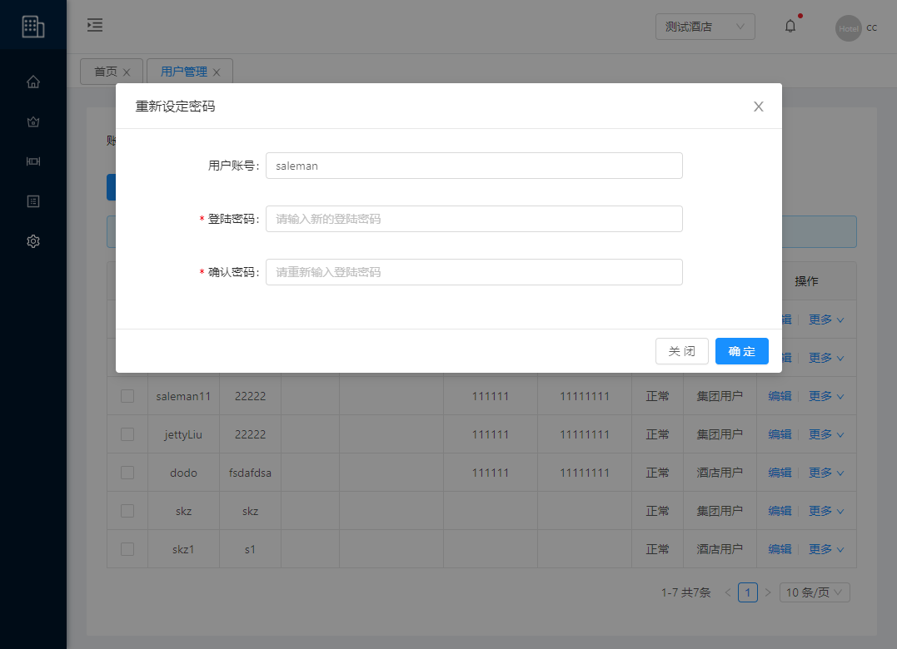

## 角色管理

::: tip 描述
用于角色的添加、编辑、删除、授权
:::

### 添加

**操作步骤**

1. 进入系统: `系统管理`-`角色管理`-`添加角色`。  

2. 编辑角色信息。

3. 点击`确认`进行保存。  

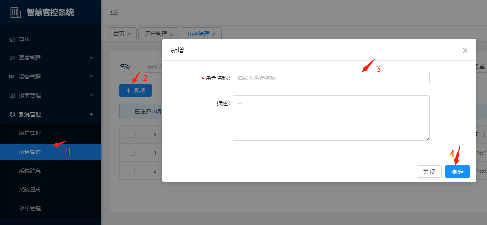

### 编辑

**操作步骤**

1. 进入系统: `系统管理`-`角色管理`，在操作列点击`编辑`。

2. 编辑角色信息。

3. 点击`确认`进行保存。  

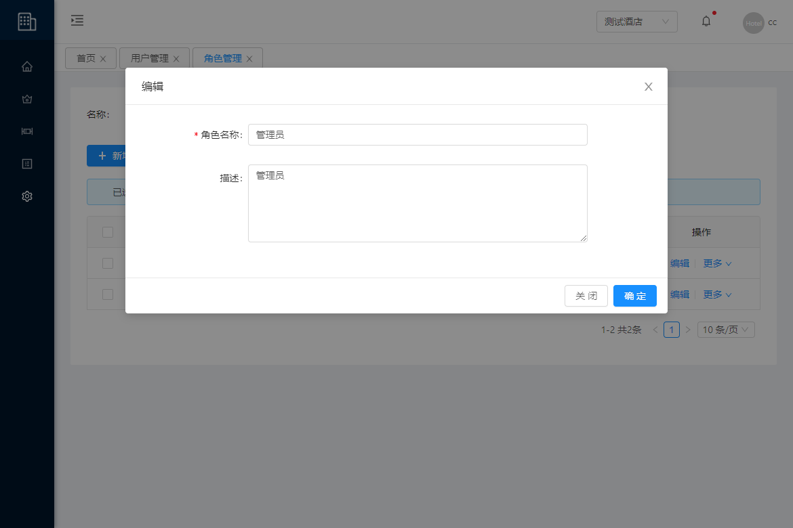

### 删除

**操作步骤**

1. 进入系统: `系统管理`-`角色管理`，在操作列点击`更多`-`删除`。

2. 在提示框中点击`确定`进行删除。

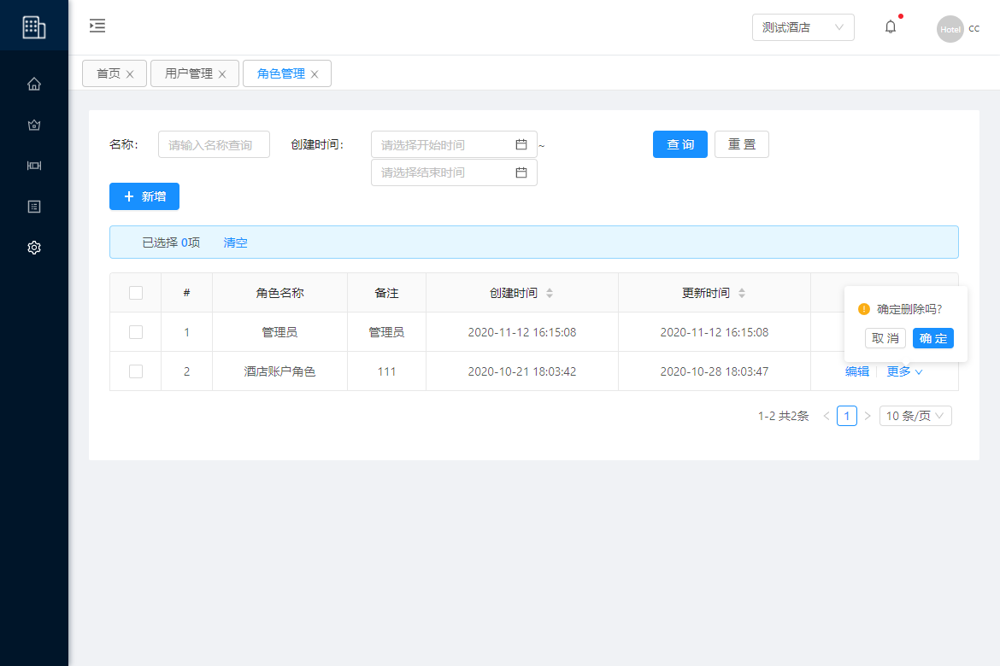

### 授权

::: tip 注意
应根据业务能力对不同角色进行权限划分，以赋予相应的菜单能力
:::

**操作步骤**

1. 进入系统: `系统管理`-`角色管理`，在操作列点击`授权`。

2. 勾选菜单权限。

3. 点击`确认`进行保存。  

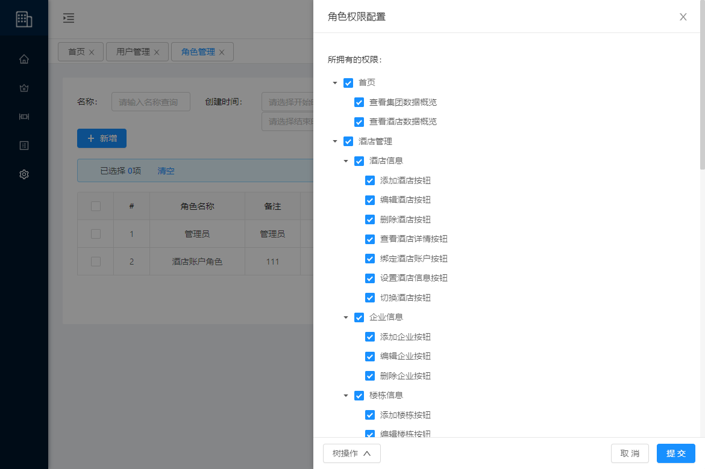

## 系统消息

::: tip 描述
用于系统的推送信息，设备上线、离线、异常及酒店欠费
:::

### 全部标注已读

**操作步骤**

1. 进入系统: `系统管理`-`系统消息`，点击`全部标注已读`。

2. 在确认框中点击`确认`

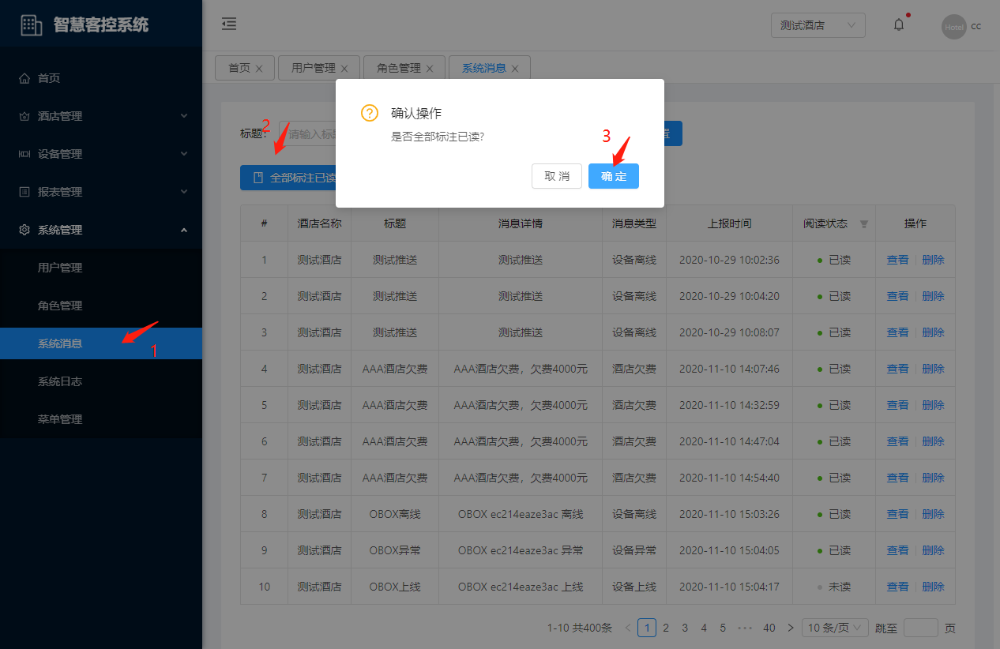

### 查看

**操作步骤**

1. 进入系统: `系统管理`-`系统消息`，在操作列点击`查看`。

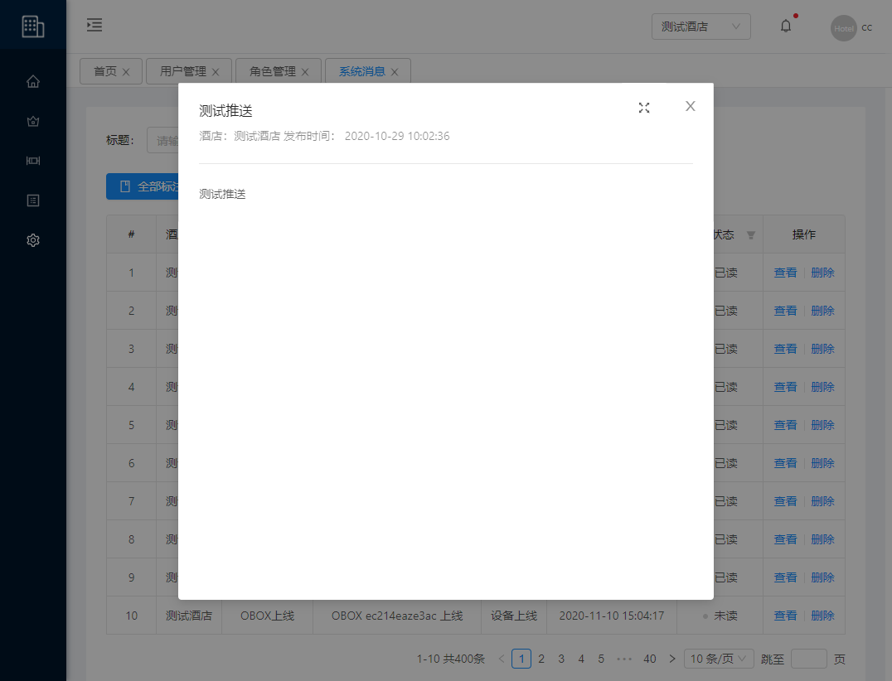

### 删除

**操作步骤**

1. 进入系统: `系统管理`-`系统消息`，在操作列点击`删除`。

2. 在提示框中点击`确定`进行删除。

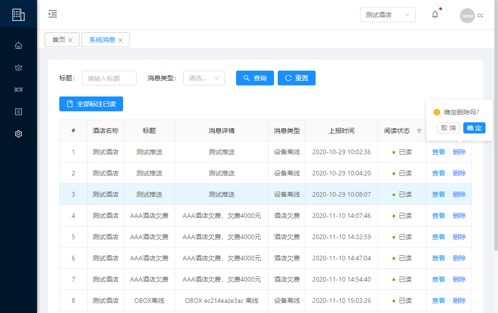

## 系统日志

::: tip 描述
用于记录系统的操作记录
:::

### 查看

**操作步骤**

1. 进入系统: `系统管理`-`系统日志`。

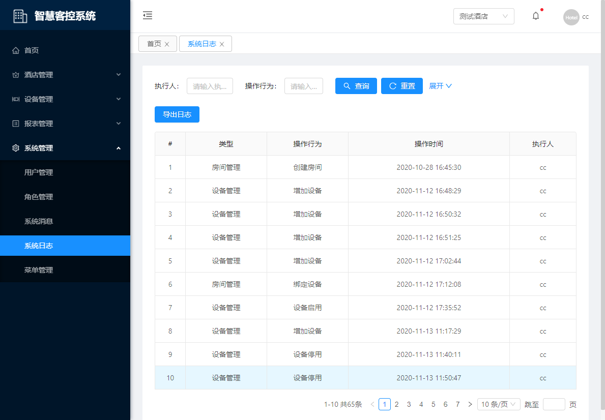

### 导出

**操作步骤**

1. 进入系统: `系统管理`-`系统日志`, 点击`导出日志`。

2. 选择开始、结束日期。

3. 点击`确认`导出记录

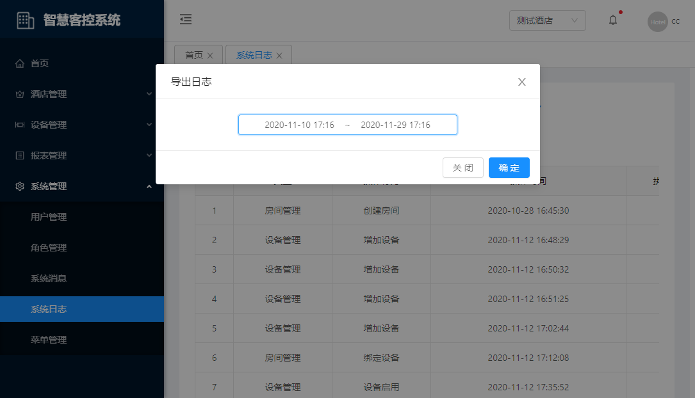

## 菜单管理

::: tip 描述
:::
